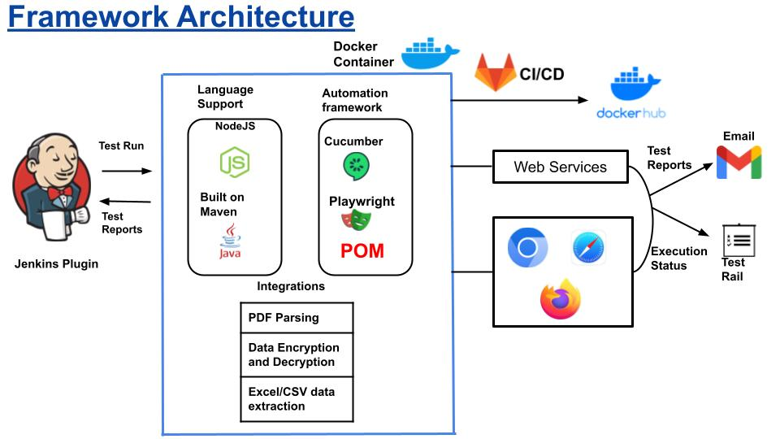
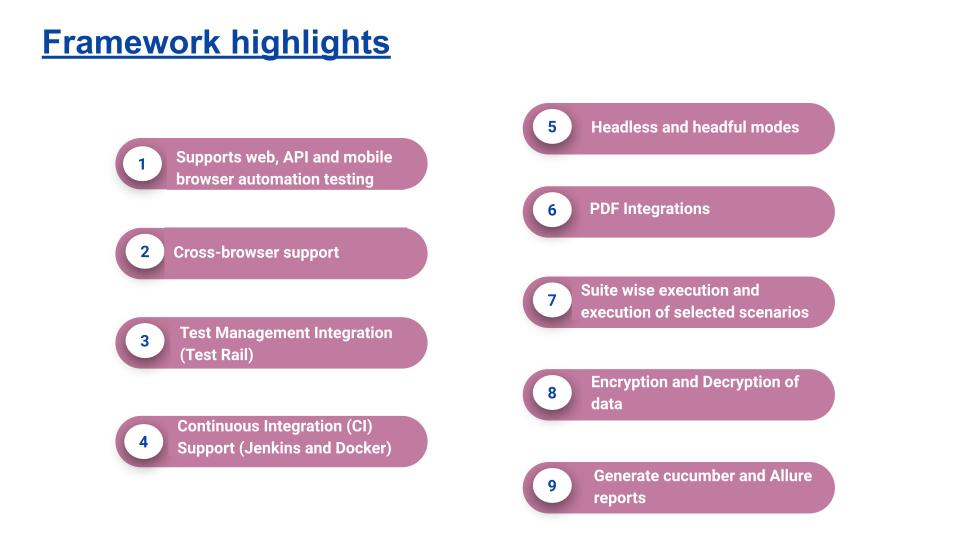

# JS_Playwright_framework

## Getting started

Playwright Cucumber framework




This project is currently based on

 - Playwright
 - Cucumber
 
## Project Structure
- allure-config
Configuration file for allure reporter
- config
Contains API endpoints and configuration files for tst, stg and prd environment. Update app url and user credentials here
- datainput
Place your input excel files here
- features
Write your Cucumber feature files here
- helper
Helper files required for supporting data input
- page-objects
Write your page elements and supporting business functions here
- reports
Contains the report after execution
- setup
Contains the test setup and intialization files
- step-definitions
Write your Cucumber Step definitions here
- testData
Place your api input data json here
- utils
Write your business utility functions here
- cucumber.js
Add your Cucumber profiles in this file which can then be used in package.json scripts
- execute.sh
This file can be used for command line and CICD execution of tests

## Pre-requisites
```
Node : v18.16.0 (recommended)
npm : 9.6.7 (recommended)
```

## Run Tests
- Clone repo https://code.qburst.com/playwright-test-automation-framework/js_playwright_framework.git
- Install the project using `npm install` command
- Update the /setup/configData.js with values for the below variables

```
parallel: 1
headlessMode: false
device: devices['Nexus 10']
default_timeout: 30,
```

Note: 
- browserName takes below 3 values which can passed as cmd arguments
```
chromium (default - if no browser is passed)
firefox
webkit
```
- parallel takes any numeric value greater than `0`
```
0 - Execute tests in Parallel mode
1 - Execute tests in Sequential mode
```
- default_timeout takes any numeric value greater than `0`
```
Here the browser times out after the specified time, the value passed should be in seconds.
Default value is set to 30 seconds.
```
- headlessMode : `true` or `false` (Default `False` if no value is provided)
- device takes predefined device names supported by Playwright. Some of them are
`Galaxy S9+`, `Galaxy Tab S4`, `iPad Mini`, `iPhone 11`, `iPhone 12`. Refer [here](https://github.com/microsoft/playwright/blob/main/packages/playwright-core/src/server/deviceDescriptorsSource.json) for more

If you want to run in browser resolution, keep the value empty, for eg: devices['']
Always use webkit for iOS mobile viewports and chrome for Android mobile viewports
- Update the username and password in base64 encrypted format in respective environment files in config/<>.json
```
"username": "",
"password": """
```
- Use this command to run the test in required environments with default values : tst, stg, prd
Following commands will execute on Chromium browser with Cucumber report by default
```
npm run tst
```
```
npm run stg
```
```
npm run prd
```

To run regression in tst environment: 
Note :- This framework picks Scenarios with tag @Regression as regression test cases
```
npm run regression
```

- To run tests with various parameters
```
browser=firefox test_env=tst reporter=cucumber npm run testing
```
```
browser=firefox test_env=tst npm run tst
```

- To run different suites using execute.sh
```
./execute.sh tst firefox allure
```
Note: Change the environment, browser or reporter values in above commandas per need. Please make sure to run the command in argument order same as above.


## Run API Tests

To run the API tests, run the below command:

```
npm run testapi
```

To run the API and UI combination test, run the below command:
```
npm run testapiui
```

## To create new API test cases

1. Update the API base url, and user credentials in `/config/default.json` with values for the below variables

```
baseUrl: "url",
username: "username",
password: "password"
```
Note:
- The `username` and `password` should be in base 64 encorded format

2. Update the corresponding API end points in `/config/apiEndPoints.json`

3. Update the test data in `/step-definitions/testData/apiTestData.json` with the key value pairs as per the requirements

4. Create new feature file for the test scenario under `/features/` folder with `.feature` extension

5. Update the corresponding step definitions in `/step-definitions/api.e2e.step.js`

6. API utility methods should be implemented within the `/utils/ApiUtils.js` file. Update the UI actions in `/page-objects/HomePage.js` file (If API and UI combination is required)

7. Create a new test script for the newly added test case in `package.json` file under `scripts`

8. To run the test cases use the below command

```
npm run *script
```


To use allure reporting use the allure profile in scripts for the required environment within package.json file as:
```
"test": "rm -rf reports && chmod +rwx execute.sh && ./execute.sh && npx cucumber-js -p allure"

```
Note:
- You can make any number of profiles with a particular tag in the cucumber.js file 
- We have used the cucumber reporting by default.
- Use allure reporting with the allure profile as '-p allure' within the scripts.
- While allure reporting dot report wont be generated.
- Adjust the package.json script and cucumber.js to run the required scenarios in a particular environment. Refer [here](https://github.com/cucumber/cucumber-js/blob/main/docs/profiles.md#using-profiles-for-arguments) on how to run multiple profiles

## To run multiple scenarios:
- Update the scenario names in suites/default-scenarios.csv in the format "``scenario:`` exact_scenario_name"
- You can also create new csv files inside the suites folder with scenarios listed in the format "``scenario:`` exact_scenario_name"
- You can execute the scenarios using the shell script:

```
chmod +x multiple.sh
./multiple.sh scenarios.csv
```
- Here you should replace ``scenarios.csv`` to the csv file you want to use and it should be located in the ./suites folder.
- All the scenarios listed within the ``scenarios.csv`` will be executed
- You can also specify the test environment, browser, and report to be used as follows:

```
./multiple.sh scenarios.csv tst chrome cucumber
```
- By default we will be running all the scenarios listed within suites/default-scenarios.csv file in the ``tst`` environment on the ``chrome`` browser and we use ``cucumber`` reporting.

## To update the test status for the particular test case in test rail
- You can use the command:

```
npm run run-in-testrail
```
Note: the `runname` value can be based on your run in `Test Runs & Results` in `Test Rail`


## Run Lint for static code analysis
   ```
   Tool Used : eslint
   Command : npm run lint
   
   ```

## Generate Cucumber report
After executing the tests, corresponding cucumber-report.json file will be generated in reports/json
Run the following command to genereat html version of cucumber report
   ```
   Command : npm run cucumber-report
   ```

## Generate allure report
After executing the tests, corresponding allure result xmls will be generated in reports/json/allure-results
Run the following command to generate html version of allure report
   ```
      Command : npm run generate-allure
      Command : npm run allure-report

   ```

## Open-Trace
   ```
   Command : npm run open-trace
   Note: By default trace is generated for each feature and can be viewed in a single trace view

   ``` 
## Email the report
   - You should first configure your username and app password within setup/configData.js.
   - Recipient list should be updated in the `send-report` script in `package.json`.
   - Comma-separated recipient list can be added.
   ```
   Command : npm run send-report
   Note: By default the system emails a basic email test report.
   
   ```
   `Email with Allure-report`
   ```
   command: npm run send-report allure
   Note: This sends the basic test email along with allure-report.html and allure.pdf
   ```
   `Email with Cucumber-report`
   ```
   command: npm run send-report cucumber
   Note: This sends the basic test email along with cucumber-report.html
   ```
## Read Data from excel sheet


    Note:
    -User should add excel sheet in "datainput" folder as xlsx file
    -User can read data from the xlsx file by using file path and sheet name
    -The sheet name should match with sheet name in excel sheet for reading excel sheet
    -User can read data under a particular header by passing the header name
    -User can also get values as dictionary by using "getAsdict" method
    
## Using docker

  `Pre-requisite`
  ```
  Should have docker installed
  Should be logged into the docker-hub account to publish latest docker images
  ```
  `Use the following command to build a docker image`
  ```
  docker build --build-arg SECRET_KEY=$SECRET_KEY -t docker-hub-username/image-name .   
  ```
  `Command for tagging a docker image`
  ```
  docker tag docker-hub-username/image-name docker-hub-username/image-name:tag_name
  ```
  `Command for running the docker image`
  ```
  docker run docker-hub-username/image-name:tag_name
  ```
  `You can also specify the environment variables while running` 
  ```
  docker run -e ENV=tst -e BROWSER=firefox -e REPORT=cucumber docker-hub-username/image-name:tag_name
  ```

## CICD Integration with Jenkins

  `Pre-requisite`
  ```
  xvfb plugin should be installed
  After installation configure the plugin in Global Tool Configuration
    Name : "default Xvfb"
    Directory in which to find Xvfb executable : "/usr/bin/X11"
    
    Enable "Start Xvfb before the build, and shut it down after." option in Jenkins job configuration "Build Environment" section
  ```
  `Use the following command in Jenkins script execution window for running the tests`
  ```
npm install
npx playwright install-deps
chmod +x execute.sh
./execute.sh ${env} ${browser} ${reporter}
  ```